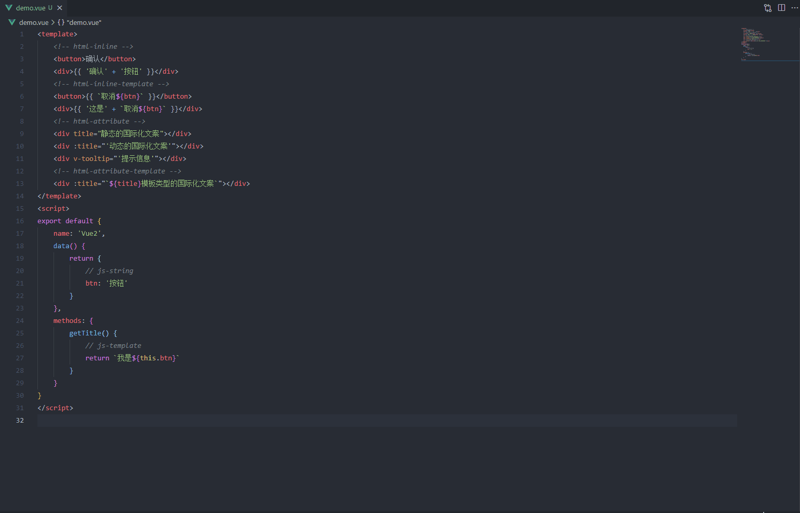
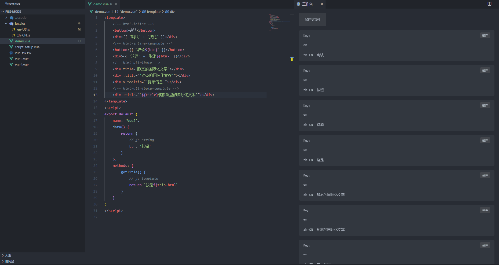
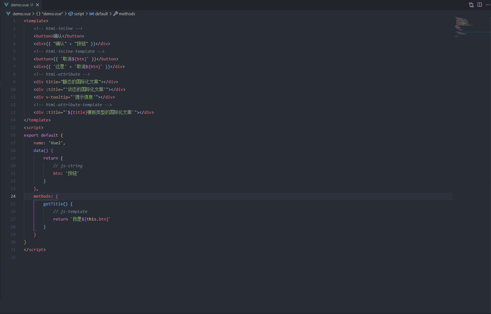

    

<h1 align="center">i18n-workbench</h1>

这个插件能够帮你更快速规范在开发时对项目进行国际化。

i18n-workbench是一个国际化解决方案，尤如其名《国际化工作台》，一种从交互链路上入手的国际化解决方案。

希望此插件能够帮助到大家，或者有想法的小伙伴可以基于此插件做些定制化的功能，提高团队效率。再或者可以从意识层面启发大家可以从哪些方面入手去解决问题。

<h2 align="center"> ✨ 主要功能</h2>

### 提取文档中的文案 & 并在工作台中展示

### 插入国际化资源文件

### 替换当前文档中的文案

<h2 align="center"> ❓ &nbsp如何使用 </h2>

### 设置语言目录
> 不出意外导入插件后就会自动识别目录了，如果出了意外那就 `Ctrl + P`输入`手动设置语言目录 | i18n-workbench.config-locales`

#### 目录结构

    file(文件模式)：
    - locales
        - zh-CN.js
        - en-US.js
    dir(目录模式)：
    - locales
        - zh-CN
            - common.js
            - table.js
        - en-US
            - common.js
            - table.js

### 打开翻译工作台

> Ctrl + P 输入打开翻译工作台 | i18n-workbench.open-workbench

### 替换当前文档

> Ctrl + P 输入替换当前文档 | i18n-workbench.replace-with

## ❤️ Thanks
- [@antfu](https://github.com/antfu)
